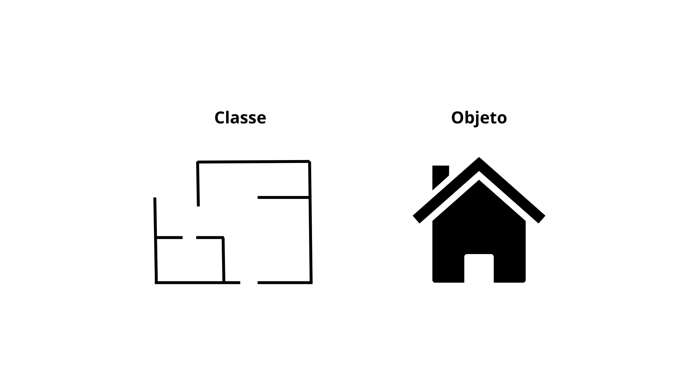

# Programação Orientada a Objetos: 

Meu início em programação orientada a objeto (POO). 

## 1. Classes e Objetos:

- **Classes** é um modelo, molde, uma planta de um prédio. 
- O **objeto** é sua instância (concretização do molde).



Os objetos tem **atributos** e **métodos**.

- **Atributo**: cor da casa, tamanho, quantas janelas e etc.
- **Métodos**: comportamentos, ações. 

Uma classe pode ter vários objetos. Pense na classe Casa, cada casa construída em cada esquina, rua e bairro é um objeto que vem da mesma classe, mas com suas peculiares diferentes.

### Encapsulamento: 

Serve para obtermos: 

- **Proteção dos dados:** protege o estado interno da classe. Atributos privados não podem ser modificados. 
- **Controle de acesso:** controlar como são acessados e modificados (``getter`` e ``setter``).
- **Manutenção:** código interno não afeta código interno.

#### Privados e Públicos:

- Atributos privados (``private``): impede acesso a eles de fora da classe. Declarar atributos como públicos (`public`) permite que qualquer classe em qualquer pacote acesse e modifique esses atributos diretamente. Isso pode levar a vários problemas
- Métodos públicos: permite acesso controlado aos atributos privados.

### Métodos getter e setter:

- ``getter``: métodos que permitem a leitura do valor de um atributo.
- ``setter``: métodos que permitem modificar o valor de um atributo, com validação para garantir a integridade dos dados.

### Código: 

#### Inicializando: 
```java
public static class Predio {

}
```

#### Atributos: 
```java
// Atributos privados da classe Predio 
private String cor; // Cor do prédio 
private int andares; // Quantidade de andares no prédio 
private int janelas; // Quantidade de janelas no prédio
```

#### Métodos getters:
```java
// Método getter para o atributo 'cor' 
public String getCor(){ 
	return cor; // Retorna a cor do prédio 
} 

// Método getter para o atributo 'andares' 
public int getAndares(){ 
	return andares; // Retorna a quantidade de andares do prédio 
}
```

#### Métodos setters:
```java
// Método setter para o atributo 'cor' 
public void setCor(String cor){ 
	this.cor = cor; // Define uma nova cor para o prédio 3
} 

// Método setter para o atributo 'andares' 
public void setAndares(int andares){ 
	this.andares = andares; // Define uma nova quantidade de andares para o prédio 
}

```
#### Construtores: 
```java
// Construtor da classe Predio
    public Predio(String cor, int andares, int janelas){
        
        this.cor = cor;
        this.andares = andares;
        this.janelas = janelas;
    }
```

Quando você cria um novo objeto de uma classe, o construtor define os valores iniciais dos atributos do objeto, garantindo que ele esteja em um estado consistente desde o início. Cada vez que você cria um novo objeto, o construtor é chamado para inicializar esse novo objeto com valores específicos, que podem ser diferentes de outros objetos da mesma classe.

#### Instanciação de objeto:

```java
 Predio predio1 = new Predio("Amarelo", 10, 20);